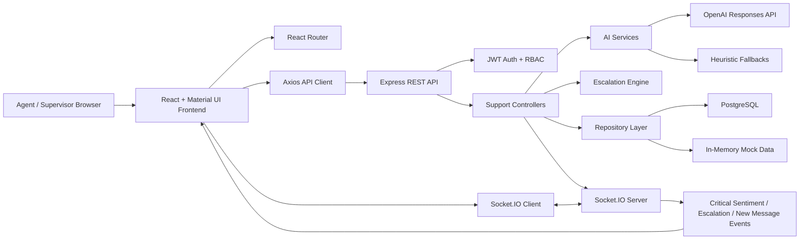

# Unified Omnichannel Customer Support Intelligence Hub Architecture

## Runtime Modules

- `frontend/`: React application with authenticated agent workspace, customer 360, supervisor dashboard, Recharts analytics, and Socket.IO notification listeners.
- `backend/`: Express API with clean route, controller, service, repository, middleware, and real-time layers.
- `database/`: PostgreSQL schema and seed data for users, customers, interactions, tickets, sentiment history, and escalations.
- `docs/`: Architecture and implementation documentation.

## AI Flow

1. Customer message is posted to `POST /api/messages`.
2. The backend loads recent customer context and analyzes sentiment.
3. The escalation engine evaluates sentiment score, negative streak, and critical keywords.
4. Medium or higher risks create a ticket and escalation record.
5. Socket.IO emits real-time notifications to the support floor.
6. Agents can generate replies or conversation summaries on demand.
